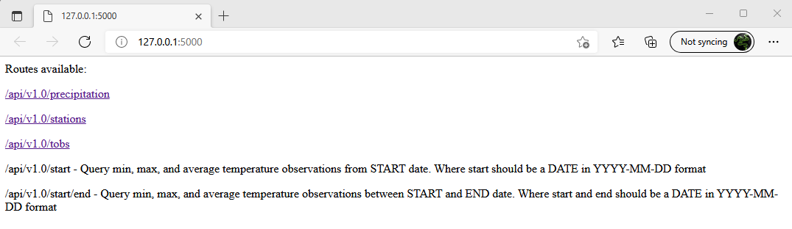

# Climate Analysis Hawaii

### Summary

An analysis and viualisations of Hawaii climate using data from stations that record precipitation and temperature data across various points in Hawaii. 

I used SQL ALchemy and Jupyter Notebook to read the SQLite file and used SQLAlchemy ORM queries to query the database, then Pandas and Matplotlib to create plots.

Also created a Flask based application to create an API that returns different query results across different endpoints.

### Precipitation Analysis

### Temperature Analysis

### Flask App

 
 

 

### Abz Raja